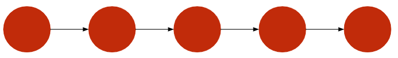

# Chapter
When talking about blockchain we are talking about a system.

:::{note}
What is a system? [Merriam-Webster](https://www.merriam-webster.com/dictionary/system)
defines *system* as "interacting or interdependent group of 
items forming a unified group". This isn't the best, or most 
concrete, definition so for this textbook we define system sa *a 
group of computers, nodes, trying to work on a singular application.* 
This singular application can be as big or as small as it wants.
:::

System architecture is a whole course in itself, at
Cornell its [CS4410](https://cornellcswiki.gitlab.io/classes/CS4410.html),
so we will not be going into any sort of depth on the topic.
All we need to know that systems can be structured in three basic
ways:
* **Centralized**: The whole network revolves and depends on
a 'leader' node (i.e. Facebook).
* **Decentralized**: The whole network revolves and depends on
a *group* of 'leader' nodes (i.e. Tor).
* **Distributed**: A network composed of equal *peer* nodes 
that are variously connected between each other. There is no
'leader' node (i.e. I.o.T).

:::{tip}
The definitions of decentralized and distributed are often 
used interchangeably. You might find blockchain being called
distributed on website and decentralized on the next. Formally
the two terms are different but for 95% of sources on the
blockchain, including this textbook, they mean the same thing
which is that the system isn't centralized.
:::

The three types all have their uses and there is no one type 
that is better overall. Saying this we have to concede that 
an overwhelming majority of consumer-facing applications are
built on centralized systems. 

Why? Centralized systems are easy to control and run, so they 
are often the first choice for already centralized companies. 
But centralized systems aren't perfect.
* Centralized systems are fragile in that if the 'leader' node
falls so those the whole system. 
* Censorship is far easier to implement on a centralized system
than on one of the others.
* Centralized systems have limited privacy.

A good example of how centralized systems can go wrong was [Facebook's
2021 outage caused by a maintenance failure on their centralized servers](https://blog.cloudflare.com/october-2021-facebook-outage/).

Distributed and decentralized systems largely address the above, 
so we might think they are the solution. But they, too, have problems.
A *Byzantine* problem.

## The Byzantine General's Problem


Formally, the Byzantine General's Problem (*BGP*) is a *game theory* problem
plaguing distributed systems. The problem goes as follows:

A group of generals besieged the city of Byzantium. To take the 
city they have to attack all at once BUT:
* The Generals have unreliable messengers who might have been
infiltrated by Byzantium.
* Some generals may be traitors.

There are many adaptations of this problem but the issue is the 
same: How do you work with a group of peers you don't trust 
and communication between you is unreliable. 

This problem affects distributed systems because of the equality of nodes. 
There is no gatekeeper, anyone can join the system and communicate
with whom ever they want. This means your peers may be malicious 
actors trying to subvert the system, or they may be honest nodes that
just have very bad internet, so they get only some of the
critical messages needed to support the system. 

Although *BGP* is at heart a theoretical problem it has 
a number of real-world applications. These include:
* Communication between nuclear submarines
* An international team of developers trying to build 
a product (i.e. Whatsapp)
* The Internet

One of the largest distributed/decentralized systems is after all
the internet. Anyone can host a website and anyone can
visit and this made managing payments very hard. Some websites
use credit cards, but these can be misused by malicious websites, 
while others just trusted the customer would pay when the product would
physically be delivered. In short *BGP* meant there was no clean 
solution to online payments.

## Blockchain as a solution
On Halloween in 2008 a solution to the payment problem was announced
under the whitepaper *Bitcoin: A peer-to-peer electronic cash system*.
Although the author never used the term, the whitepaper created *Blockchain*, a 
technology and data-structure that solved *BGP*.

### Storing the Data
The remainder of this chapter will be looking at a 
subset of the solution: storing the information the 
generals send each other. The following two chapters 
will complete the solution.

We need a *data-structure* that can store information 
among a *trustless* system. This data-structure 
needs to address the following:
* How the actual data will be structured.
* How will data be added/edited.
* How will we make sure the data is valid.
* How will we make sure everyone has the same set of data.

:::{note}
By *trustless* we don't mean a system with 0 trust but rather a system you can 
trust even if you don't trust the participants. This might seem paradoxical but
its actually one of the wonders of the blockchain and in this chapter we will take 
a peak into how this is possible.
:::

### Conventional Methods
Traditionally, when we want to store big sets of data we look at databases. 
[Databases](https://www.oracle.com/database/what-is-database/#:~:text=A%20database%20is%20an%20organized,database%20management%20system%20(DBMS).&text=Most%20databases%20use%20structured%20query,for%20writing%20and%20querying%20data.)
are an organized collection of data often arranged into a set of tables. To
look whether we can use purely databases lets try to answer our 4 questions with
databases:

* **How will the data be structured?** - In groups of inter-related tables.
* **Adding/editing the data?** - As we are working with a distributed system which 
anyone can join the answer is anyone can add and edit data.
* **Validity of data?** - As anyone can add/edit data we don't really have a way
to efficiently check if the data is correct.
* **Same version of data?** - We have to centralize the system to the same copy
of the database for everyone, a [concurrency](https://www.techopedia.com/definition/25146/programming-concurrency)
nightmare not to mention that it stops being a decentralized system. There is 
really no other solution inherent to databases.

:::{note}
We intentionally put *purely* databases above. This is because databases are
in many ways an inherent way to store data and many blockchain implementations
do actually store their local version of the blockchain in a database. The above was 
meant to showcase that we can't only depend on conventional methods, that is
we need something extra, something new. 
:::

Clearly using *just* databases isn't enough. Not having a gatekeeper is looking like a 
problem. By going over the questions we realize that conventional methods don't quite
cut it. Our ideal data-structure would have the following properties:
* Is ordered.
* Has clear rules on who and how data is added.
* Data present in the structure can be easily verified by anyone
* Is *immutable*, that is once data is added it can't be deleted or edited.
* Can be shared easily among nodes in the system.
* Anyone can contribute to it but can only submit valid data.

### Blockchain Implementation (*BADS*)
The blockchain meets the requirements above through the following data-structure:
* Data is ordered into *blocks* and structured by *Merkle Trees*.
* *Blocks* are united through a *linked list*.
* *Blocks* are added on a regular basis to the *linked list* and must be valid to
be added.
* Everyone has an identical version of the above and can propose new *blocks* that
should be added.

This composite data structure is the Blockchain-as-a-data-structure (*BADS*)

:::{tip}
We just used alot of new definitions like linked lists, merkle trees and blocks. 
If this looks overwhelming don't worry we will cover all of them in the rest of 
the chapter. Once you read what all of these terms mean it could be useful to go over
the above again.
:::

**Linked Lists** are pieces of data that *point* to each other forming a chain. 
They are an incredibly important data structure in all of computer science, as 
anyone who has taken Cornell's [CS2110](https://cornellcswiki.gitlab.io/classes/CS2110.html) or ever prepared for an S.W.E interview knows. 
A piece of data, also called a node but not to be confused with nodes in a system, 
either point to another node or to nothing, but importantly they can only point to **one** 
other thing and is pointed to by a maximum of one other node. This means two nodes cannot
point to the same node.

They have the following benefits:
* Clear process to add data, you just point your new data to the most recent data already
in the linked list.
* Immutable. To replace one node is to replace all the nodes that point to it either
directly or indirectly.

As such linked lists have solved several of our desired B.A.D.S qualities. Namely 
*An ordered data structure*,*Clear process to add data*,*Immutable*.

:::{note}
Linked Lists, in their basic form, have 'soft' immutability. By this we mean it is 
a nuisance to delete data, but it can still be done, editing is unaffected. But, 
as we will see, Blockchain's linked list has 'strong' immutability. By principle, Blockchain
linked lists are add-only, so if you are to act honestly you will only every add nodes,
not edit or replace them. 
:::



**Blocks** are the nodes in *BADS*'s linked list. Blocks are composed of a header and 
data. The data the block contains must be validated by the data in preceding blocks. 
Blocks point to each other by storing the *hash*, a sort of data signature, of the 
previous block, there is no 'physical' link between the nodes. 

Blocks and the linked list give the technology its name as: **Block + Chain**. 

The former part coming from nodes and the latter part coming from the fact that 
linked lists 'chain' data together. We explored the expanding tail of the blockchain 
linked list but what about its head? What is the 'first' block and what does it point
to? In blockchain, we call this block the *genesis block*.


**Genesis Block** is the oldest block in the linked list and the only one that points to 
nothing. It comes *hard-coded* in most blockchain implementations and is the only 
block that is inherently true. This means our trust in the blockchain is partly
based on our trust that the data in the genesis block is valid. Genesis blocks often 
dont contain alot of information and are often used for grand statements, like Bitcoin's
was. 

```{epigraph}
The Times 03/Jan/2009 Chancellor on brink of second bailout for banks
-- Bitcoin Genesis Block
```

Blocks and the linked list address another desired characteristic of BADS: *sharing 
the data structure is efficient*. This is because to update the data structure we only
need to share the latest block, each node can then add this block to their own private
and much larger blockchain. The initial blockchain 'download' is still slow, but now it
only has to be done once. We still need to guarantee that every node gets the same
block and that it is in the correct order. This is called reaching *consensus* and 
Blockchain achieves it through several *consensus algorithms* like *PoW* or *PoS*.

Above we often mentioned that data in a block has to *valid* and that only the genesis block
has the luxury of being automatically correct. But what does this actually mean? 

For those who have done some discrete math, i.e. have done Cornell's 
[CS2800](https://cornellcswiki.gitlab.io/classes/CS2800.html), this process is similar to
induction where the genesis block is the *base case* and adding blocks is the *inductive case*.

For those who haven't done any discrete math we can look at it as follows: 
* The data cannot be proven incorrect by the data in preceding blocks.
* The data must have the same structure as data in the preceding blocks.

The above is only a generalization as the exact definition of what it means to be *correct*
depends on blockchain.

:::{admonition} Example
:class: tip
Lets look at a theoretical blockchain that tracks how much legos you own.
* The genesis block says you have 1 lego
* The block after genesis says you lost 1 lego
* If any block after that says you lost more legos the data in that block is invalid
as you can't have less than 0 blocks. 
:::

We now have a way to organize data, a block chain, but how do we organize data within 
blocks? This is an important question as we need to guarantee the following:
* The data must be clearly ordered so different nodes can have the same version
* The data has to have a 'signature' that we can use to quickly check it's the same as
the data of other nodes
* The data has to be immutable
* We need to guarantee that data is unaltered when it is sent from one node to another, 
this is to protect against unreliable or malicious communication channels.

Using purely a database would introduce a smaller version of our original problem 
and a linked list would be too complicated. Fortunately we have a data structure that
addresses all of our demands, a *Merkle Tree*.

:::{admonition} On Trees
*Merkle Trees* are a type of *tree*. Trees are an incredibly useful and widespread CS
data structure and their use cases go far beyond blockchain. Although we will not cover 
trees in depth we need to understand their basic architecture and some key terminology.
Trees work much like linked lists in that they are composed of nodes pointing to other 
nodes. But in the case of trees multiple nodes, the *children* can point to the same node,
the *parent*. If we plot this relationship it looks like a tree, hence the name. Binary
trees are trees where every parent can have at most 2 children, this means a node can be
pointed to by a maximum of two other nodes. 
:::


**Merkle Tree** is a binary tree where every node has a hash, digital signature, which
is the hash of the hashes of its two children. The actual data is stored in *leaves* 
whose hash makes up the first layer of nodes that eventually connect to the Merkle *root*
which is a unique digital signature of the whole set of data. This digital signature
has a given size, but it can represent a data set of infinite size. We cannot understate
the importance of this data structure in blockchain. It appears everywhere in nearly
every implementation and add-on, after *BADS* Merkle Trees are the data structure of the blockchain.

Merkle Trees largely rely on *hashes* which, in a simplified sense, are a unique 
fixed-size signature of the data provided. The idea that every piece of data,
be it an image or just a combination of other hashes, has a unique representation is
what gives Merkle Trees their power. Hashing is a fascinating and integral part of
blockchain and cryptography in general, and we will cover it in depth in the next chapter.

Merkle Trees have multiple benefits and features that address our desires for storing 
concrete data:
* Thanks to the merkle root we can quickly determine whether two sets of data, perhaps
stored by two different nodes with unreliable connections, are *exactly* the same, 
in both structure and content.
* The merkle root also makes it very easy to see if anyone edited the data as the 
root would change, and it is very difficult, to impossible, to keep the changed data but 
revert the root back to its old version. This makes merkle trees immutable.
* Changing a single piece of data means the whole merkle tree becomes invalid and to
make it work again you need to recalculate all the hashes to get a new valid root.
* The merkle root acts as a signature of the data provided so, in some cases, rather
than send all the data we just send the much smaller merkle root. 

Data within blocks is therefore stored in merkle trees, and we can represent this 
data through a small fixed-sized merkle root that is, almost, guaranteed to be unique.

We talked alot about the data stored by the block but are still missing its 'brain', 
the part that references the preceding block and contains information about the block
, like the merkle root. The blocks 'brain' is the *block header*.

**Block Header** defines the block's properties. Every blockchain implementation has
a unique header structure. Regardless a, very generalized, block header contains the 
following:
* **Version** - The version of the blockchain implementation when the block was added. Like all software 
blockchain implementation has updates and so different versions that can affect how we
determine whether a block is valid.
* **Preceding Block Hash** - The hash of the latest block before this one. This creates
the linked list.
* **Merkle Root of Data** - The root of the merkle tree storing all the block's data.
This is very useful as a node can quickly determine whether its local version of the 
data is valid. 
* **Timestamp** - The timestamp of when the block was added to the blockchain.

All the fields of the block header are filled out by the creator of the block. This
concludes our discussion of the core *BADS*. A linked list composed of blocks as nodes
which store concrete data into merkle trees and are coordinated by their headers. 

We now know how to build a blockchain as a data structure, but we don't know to run it.
The discussion above has left us with questions like who adds and validates blocks
and how is 'strong' immutability implemented into *BADS*.

### Maintaining *BADS*
Let's start with adding and validating blocks and tackle immutability later. Adding 
and validating blocks forces us to introduce another aspect of Blockchain, *networks*.

[*Networks*](https://www.computerhope.com/jargon/n/network.htm#:~:text=A%20network%20is%20a%20collection,people%20all%20over%20the%20world.)
are in the most simple sense just a set of connected computers that share data. Systems
work on top of networks. Blockchain in particular is heavily dependent on networks as 
a distributed system, and we will be devoting a whole chapter to them. 

For now blockchain can be considered as a network where *BADS* is the data shared. To determine
who adds and validates blocks is to decide which nodes add and which nodes validate the
data they all share. This is still a distributed system, so we somehow need every node
to independently, but identically, agree on which block will be added. This is called
achieving *consensus* and is the responsibility of *consensus algorithms*, which we will
cover in detail in the following chapters. 

There is broad range of consensus algorithms and there is still active research invested
in them. Consensus algorithms can have very diverse implementations so the following 
generalization does not necessarily apply to all of them. 

A generalized, but heavily inspired by PoW and original implementations of PoS, consensus
algorithm requires that all nodes store *BADS* and actively participate in trying to
add a block or validate a candidate. The general process for a node goes as follows:
1. A node collects, and verifies, data to put into its block, fills out its block header and then 
tries to validate it. This validation goes beyond the validity of the data and is the 
main point where consensus algorithms converge. Validation is always meant to take
some noticeable amount of time so the network isn't flooded with candidate blocks.
2. 1. The node successfully validates its block at which point it broadcasts its candidate
block to the rest of the network. 
     2. Before the node can validate its own block another candidate block comes in.
At this point the node stops working on its own block and checks if the candidate 
is valid. In the case it is the node abandons its attempt, adds the candidate to 
its own blockchain and tries to create the block that follows it.

Achieving consensus therefore happens at an individual level for every node, but it happens 
simultaneously. As what makes a block valid is known to the whole network, via the 
consensus algorithm, every block can individually determine whether a block is valid,
and it expresses its consent by adding it to its own local blockchain. When this happens
at a majority of nodes we consider the block to be successfully added to the blockchain.

But what about immutability? Can't someone just produce a new set of valid blocks that
replace existing blocks and then publish them to the network that accepts them? In 
theory yes but the likelihood of something like this happening is very low. We 
first must understand that at anyone time there may be multiple competing chains
and the *valid* chain is the one that is the biggest/longest. This is 
because creating, a broadcasting, a valid block is a time race and so as long as a 
majority of nodes are honest, and accept that blockchain is add-only, the attackers
won't be able to catch up with the longer, valid, chain that the honest nodes add onto.

Maintaining *BADS* is difficult to comprehend. There is no one copy of *BADS* as every
node stores its own. The 'current' version of *BADS* can be understood as the version 
a majority of nodes currently store. This brings in the concept of 'identicalness 
as a requirement' where consensus algorithms guarantee every node has the same version
of *BADS*. This requirement also essentially makes *BADS* impossible to destroy as to
do it one would have to destroy the local version of every node. 

:::{admonition} An honest majority
Above we based alot of *BADS* maintenance on the idea that a majority of nodes are
honest. This might seem like a design flaw, but it is one of the central assumptions 
of a valid blockchain. As we will discover later in the course this assumption holds
for the most part but there have been cases when it hasn't with tragic results. 
:::

## Implications of Blockchain being a solution
Coming back to *BGP* we now have a solution on the format of the messages that the 
generals send to each other. The messages are put in a blockchain, the genesis block
can contain none or some very basic information they all agree on like how many generals there are,
and each general has a local version. Generals don't need to trust the messengers, as 
a malicious message would not be supported by previous data in the blockchain, or 
other generals. They only need to trust the system and that a majority of the generals 
are honest, so they will always control the valid chain and so only exchange valid 
messages. 

This solution has an important implication, the concept that we can trust
the system rather than any particular participant in it. We trust the blockchain, we
don't need to trust any individual node/general/website. This is partially achieved
by every node verifying everything on its own and trusting no particular block/data 
sent to it.

From our discussion above we can determine several benefits of *BADS*:
* **Censorship-Resistant** - Anyone can join a distributed system.
* **Very stable** - For *BADS* to disappear every node has to delete its local version 
of it, a very unlikely event.
* **Works well over a unstable connection** - With Merkle Trees and immediate verification
upon receiving, data that is kept is guaranteed to be what the sender intended it to be.
* **Verification is conducted individually so there is no need to trust any individual participant**

There are however also drawbacks to *BADS*:
* **Inefficient by design** - Every participant has to store the exact same version
of the blockchain which from a storage standpoint, is as inefficient as it gets.
* **Limited Data** - Although we haven't delved into this just yet, the verification
of data is difficult and so a blockchain is often limited to only one type of data it
can store.
* **Dishonest Majority** - There is always the small possibility that a majority of the
nodes are dishonest in which case our concept of a valid blockchain collapses. 
* **Blockchain Bugs** - Because of how blockchains are implemented, if there is a bug
it is, like the data, immutable. We will cover this in detail in a later chapter.

This doesn't mean *BADS* is inherently flawed, it just goes to show that *BADS* isn't
a universal solution to everything. Like databases and centralized systems, blockchain
has use-cases it's useful for and use-cases it's not.  

:::{note}
One of the reasons why we introduced you to blockchain through Byzantine Generals is 
because we want to address a common misconception: blockchain isn't only finance. Although
Bitcoin and DeFi are successful financial applications of the blockchain they aren't 
its only applications.
:::